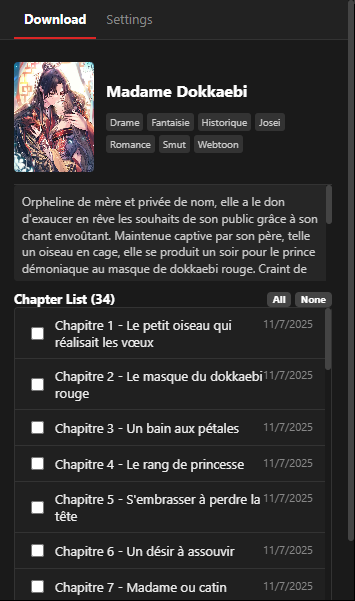
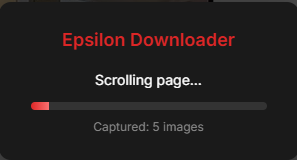

<p align="center">
  
</p>

<h1 align="center">Epsilon Scan Downloader</h1>

<p align="center">
  <strong>A powerful Chrome extension for downloading manga chapters from Epsilon Scan</strong>
</p>

<p align="center">
  
  
  
</p>

<p align="center">
  
  
</p>

---

## ✨ Features

<table>
<tr>
<td width="50%">

### 📥 Multiple Download Formats
- **Images** - Individual files organized in folders
- **PDF** - Single document with all pages
- **ZIP** - Compressed archive for manga readers

</td>
<td width="50%">

### 🚀 Smart Detection
- Automatically detects all chapters from page data
- Works with chapters that have no thumbnails
- Canvas screenshot capture for protected images

</td>
</tr>
<tr>
<td width="50%">

### 📊 Progress Indicator
- Real-time progress overlay during download
- Shows captured image count while scrolling
- Displays generation progress for PDF/ZIP

</td>
<td width="50%">

### ⚡ Batch Download
- Select multiple chapters at once
- Background processing without interruption
- Auto-close tabs after completion

</td>
</tr>
</table>

---

## 📸 Screenshots

### Extension Popup
The popup shows manga details, chapter list, and allows batch selection.

<p align="center">
  
</p>

### Download Button & Modal
When manually browsing a chapter, click the floating button to open the download modal with format selection.

<p align="center">
  
</p>

### Progress Overlay
A sleek overlay shows real-time progress during scrolling, capturing, and file generation.

<p align="center">
  
</p>

---

## 🛠️ Installation

### From Source (Developer Mode)

1. **Clone or Download** this repository
   ```bash
   git clone https://github.com/Yui007/epsilonscan-extension.git
   ```

2. **Open Chrome Extensions**
   - Navigate to `chrome://extensions/`
   - Enable **Developer mode** (toggle in top-right)

3. **Load the Extension**
   - Click **"Load unpacked"**
   - Select the `epsilonscan-extension` folder

4. **Pin the Extension** (optional)
   - Click the puzzle icon in Chrome toolbar
   - Pin "Epsilon Scan Downloader" for easy access

---

## 📖 How to Use

### Method 1: Batch Download (Recommended)

1. **Navigate** to any manga page on Epsilon Scan
2. **Click** the extension icon in the toolbar
3. **Select** the chapters you want to download
4. **Choose format** in Settings tab (Images/PDF/ZIP)
5. **Click** "Download Selected"
6. **Watch** as chapters are automatically processed!

### Method 2: Manual Download

1. **Open** a specific chapter page
2. **Scroll down** to load all images
3. **Click** the orange floating button (bottom-right)
4. **Select/deselect** images in the modal
5. **Choose format** from the dropdown
6. **Click** "Download"

---

## ⚙️ Settings

| Setting | Description | Default |
|---------|-------------|---------|
| **Scroll Speed** | Milliseconds per 100px scroll | 200 |
| **Close Delay** | Seconds to wait at page bottom | 3 |
| **Download Format** | Images / PDF / ZIP | Images |

Access settings through the **Settings** tab in the extension popup.

---

## 🔧 Technical Details

### Manifest V3 Compliant
Built with the latest Chrome extension manifest format for enhanced security and performance.

### Smart Chapter Detection
```javascript
// Parses JSON data embedded in the page
const pageData = JSON.parse(document.getElementById('app').getAttribute('data-page'));
const chapters = pageData.props.serie.chapters;
// Each chapter contains: id, uid, title, slug, views, createdAt
```

### Canvas Screenshot Capture
For protected images rendered on canvas elements, the extension captures screenshots directly from the canvas.

### Libraries Used
- **[jsPDF](https://github.com/parallax/jsPDF)** v2.5.1 - PDF document generation
- **[JSZip](https://github.com/Stuk/jszip)** v3.10.1 - ZIP file compression

---

## 🎯 Supported Sites

| Site | URL | Status |
|------|-----|--------|
| Epsilon Scan | `beta.epsilonscan.to` | ✅ Fully Supported |

---

## 📋 Permissions

| Permission | Purpose |
|------------|---------|
| `activeTab` | Access current tab content |
| `downloads` | Save files to disk |
| `scripting` | Inject content scripts |
| `host_permissions` | Access Epsilon Scan pages |

---

## 🐛 Known Issues & Troubleshooting

<details>
<summary><strong>Images not capturing?</strong></summary>

- Make sure you scroll slowly enough for images to load
- Try increasing the "Scroll Speed" value in settings
- Some protected canvases may fail due to CORS restrictions

</details>

<details>
<summary><strong>PDF generation fails?</strong></summary>

- Check browser console for errors
- Very large chapters (100+ pages) may run out of memory
- Try downloading as ZIP instead

</details>

<details>
<summary><strong>Extension icon not showing?</strong></summary>

- Click the puzzle icon in Chrome toolbar
- Find "Epsilon Scan Downloader"
- Click the pin icon to keep it visible

</details>

---

## 🤝 Contributing

Contributions are welcome! Here's how you can help:

1. **Fork** the repository
2. **Create** a feature branch (`git checkout -b feature/amazing-feature`)
3. **Commit** your changes (`git commit -m 'Add amazing feature'`)
4. **Push** to the branch (`git push origin feature/amazing-feature`)
5. **Open** a Pull Request

---

## 📜 License

This project is licensed under the **MIT License** - see the [LICENSE](LICENSE) file for details.

---

## ⚠️ Disclaimer

This extension is intended for **personal use only**. Please respect copyright laws and the terms of service of the websites you use. The developers are not responsible for any misuse of this tool.

---

## 🙏 Acknowledgments


- [meganekkowen](https://github.com/meganekkowen) for Suggesting and Testing this extension
- [Epsilon Scan](https://epsilonscan.to) for the amazing manga content
- [jsPDF](https://github.com/parallax/jsPDF) for PDF generation
- [JSZip](https://github.com/Stuk/jszip) for ZIP compression
- Chrome Extensions documentation

---

<p align="center">
  <strong>Made with ❤️ for manga lovers</strong>
</p>

<p align="center">
  <a href="#top">⬆️ Back to Top</a>
</p>
